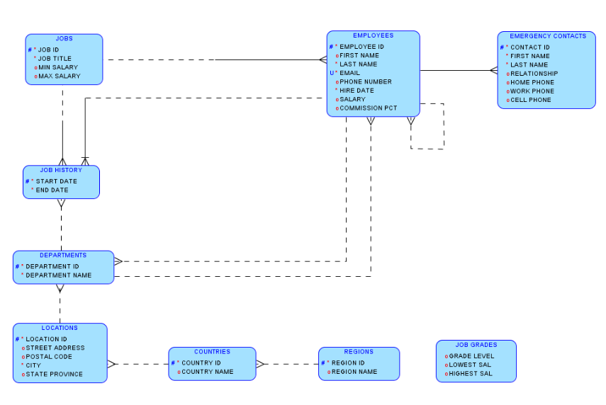
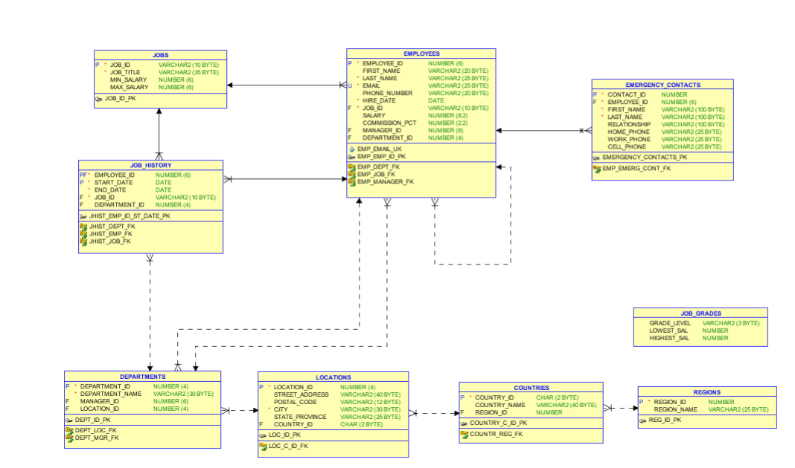

# REPOSITORIO DE ESTUDO DA MATERIA PROGRAMAÇÃO DE BANCO DE DADOS

### Segue link de anotação :point_down:

[Anotações](https://www.notion.so/Banco-de-Dados-710c8573830e4dc1a41779df68387982).

### Modelo logico do banco de dados utilizado no curso

### Modelo relacional do banco de dados uitlizado no curso

